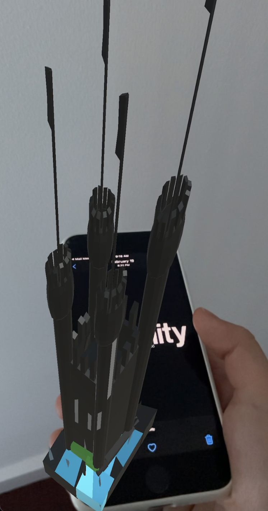

# Unity-ARFoundation-echoAR-demo-Image-Tracking

Simple face tracking demo with Unity, AR Foundation, and echoAR

## Register

Don't have an API key? Make sure to register for FREE at [echoAR](https://console.echoar.xyz/#/auth/register).

## Setup

- Create a new Unity project.
- Clone the [Unity-ARFoundation-echoAR](https://github.com/echoARxyz/Unity-ARFoundation-echoAR) sample code.
- Open the sample scene under `AR Foundation\Scenes\ImageTracking\ImageTracking.unity`.
- [Set the API key](https://docs.echoar.xyz/unity/using-the-sdk) in the `echoAR.cs` script inside the `echoAR\echoAR.prefab` using the the Inspector.
- [Add the 3D model](https://docs.echoar.xyz/quickstart/add-a-3d-model) from the [model](https://github.com/echoARxyz/Unity-ARFoundation-echoAR-demo-Face-Tracking/tree/master/models) folder to the console.
- [Add the metadata](https://docs.echoar.xyz/web-console/manage-pages/data-page/how-to-add-data#adding-metadata) listed in the [metadata.csv](https://github.com/echoARxyz/Unity-ARFoundation-echoAR-demo-Face-Tracking/blob/master/metadata.csv) file.
- Overwrite the existing *echoAR/RemoteTransformations.cs* script with the new [*RemoteTransformations.cs*](https://github.com/echoARxyz/Unity-ARFoundation-echoAR-demo-Face-Tracking/blob/master/RemoteTransformations.cs) file.

## Build & Run

- [Build and run the AR application](https://docs.echoar.xyz/unity/adding-ar-capabilities#4-build-and-run-the-ar-application). Verify that the `AR Foundation\Scenes\ImageTracking\ImageTracking` scene is ticked in the `Scenes in Build` list and click `Build And Run`.

## Learn more

Refer to our [documentation](https://docs.echoar.xyz/unity/) to learn more about how to use Unity and echoAR.

## Support

Feel free to reach out at [support@echoAR.xyz](mailto:support@echoAR.xyz) or join our [support channel on Slack](https://join.slack.com/t/echoar/shared_invite/enQtNTg4NjI5NjM3OTc1LWU1M2M2MTNlNTM3NGY1YTUxYmY3ZDNjNTc3YjA5M2QyNGZiOTgzMjVmZWZmZmFjNGJjYTcxZjhhNzk3YjNhNjE).

## SCREENSHOTS

